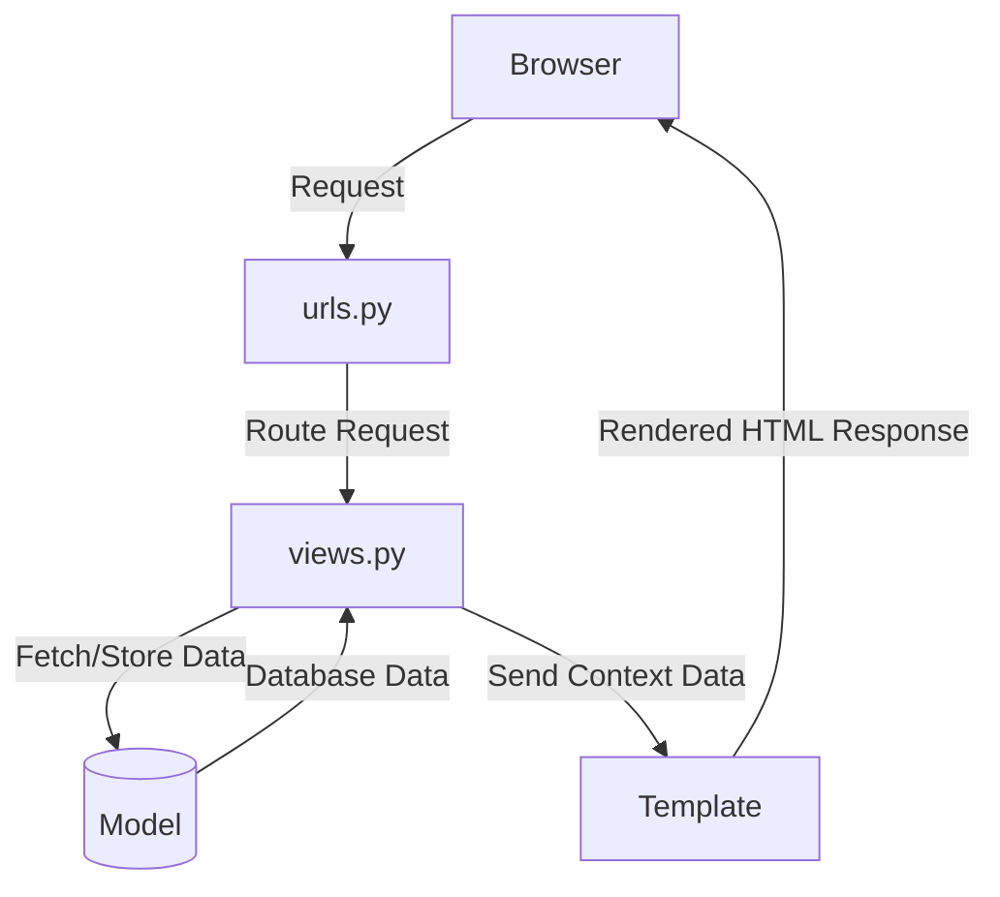

## Starting a  Django Project 
1. Create a virtualenv using `uv` 
```bash 
uv init Blogapp 
```
2. Install Django 
```bash
uv add django
```
3. Starting a Django project 
```bash
uv run python -m django-admin startproject Blogapp .
```
4. Run the server 
```bash
uv run python manage.py runserver
```

## understanding about the project structure
1. `manage.py` - A command-line utility that lets you interact with this Django project in various ways. You can read all the details about manage.py in django documentation.
2. `Blogapp/` - This is the actual Python package for your project. Its name is the same as your project. It contains the settings for your project, as well as the main URL configurations and WSGI application. 
3. `__init__.py` - An empty file that tells Python that this directory should be considered a Python package.
4. `settings.py` - This file contains all the settings for your Django project. You can read more about it in the django documentation.
5. `urls.py` - This file contains the URL declarations for this Django project; a "table of contents" of your Django-powered site. You can read more about it in the django documentation.
6. `wsgi.py` - An entry-point for WSGI-compatible web servers to serve your project. You can read more about it in the django documentation.


## MVT structure of Django
1. Model - The model is the single, definitive source of information about your data. It contains the essential fields and behaviors of the data you’re storing. Generally, each model maps to a
single database table. You can read more about it in the django documentation.
2. View - The view is the user interface - what you see in your browser when you
access a Django-powered site. It’s the presentation layer which handles the user interface part of the application. You can read more about it in the django documentation.
3. Template - The template is the presentation layer which handles the user interface part of the application
You can read more about it in the django documentation.



## migrating database into django
```bash
uv run python manage.py makemigrations
uv run python manage.py migrate
```
Then it look likes:


```bash
uv run python manage.py migrate
```
It appears


## Reterive 
## base.html=main file ,this file extend by all app.
## reusable file=nav.html


```mermaid 
    USER {
        int user_id PK
        string name
        string email UK
        string password
        string role
    }

    RESUME {
        int resume_id PK
        int user_id FK
        string summary
        text experience
        text education
        datetime upload_date
    }

    SKILL {
        int skill_id PK
        string skill_name UK
    }

    COMPANY {
        int company_id PK
        string name
        string location
        text description
        string industry
    }

    JOB {
        int job_id PK
        int company_id FK
        string title
        text description
        decimal salary
        string location
        datetime post_date
        string status
    }

    APPLICATION {
        int application_id PK
        int user_id FK
        int job_id FK
        string status
        datetime applied_date
        int resume_id FK
    }

    INTERVIEW {
        int interview_id PK
        int application_id FK
        decimal score
        text feedback
        datetime date
        string mode
    }

    SKILL_GAP {
        int gap_id PK
        int user_id FK
        int job_id FK
        json missing_skills
        decimal match_score
        datetime analysis_date
    }

    RECOMMENDATION {
        int rec_id PK
        int user_id FK
        int job_id FK
        decimal score
        text reason
        datetime generated_date
    }

    USER_SKILL {
        int user_id FK
        int skill_id FK
    }

    JOB_SKILL {
        int job_id FK
        int skill_id FK
    }

    USER ||--o{ RESUME : "uploads"
    USER ||--o{ APPLICATION : "submits"
    JOB ||--o{ APPLICATION : "receives"
    COMPANY ||--o{ JOB : "posts"
    APPLICATION ||--|| INTERVIEW : "has"
    RESUME }o--o{ SKILL : "contains"
    JOB }o--o{ SKILL : "requires"
    USER ||--o{ SKILL_GAP : "has"
    USER ||--o{ RECOMMENDATION : "receives"
    USER }o--o{ SKILL : "possesses"
    JOB }o--o{ SKILL : "needs"
```